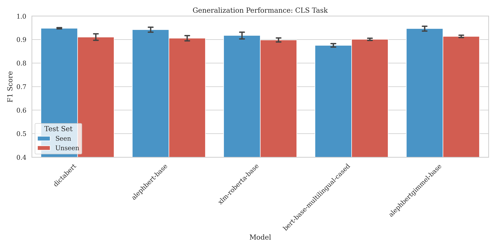
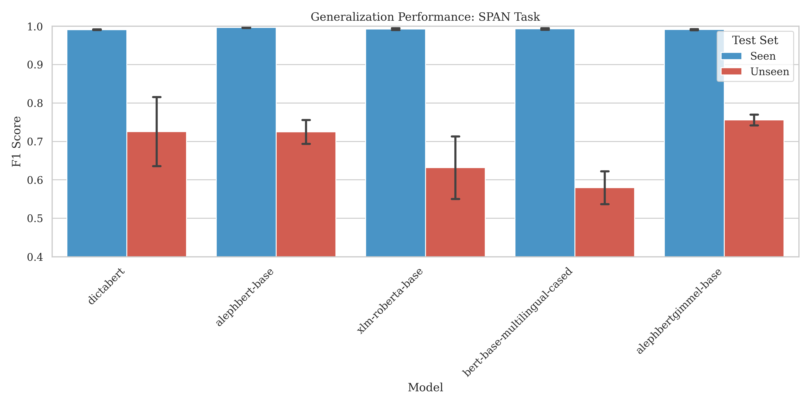
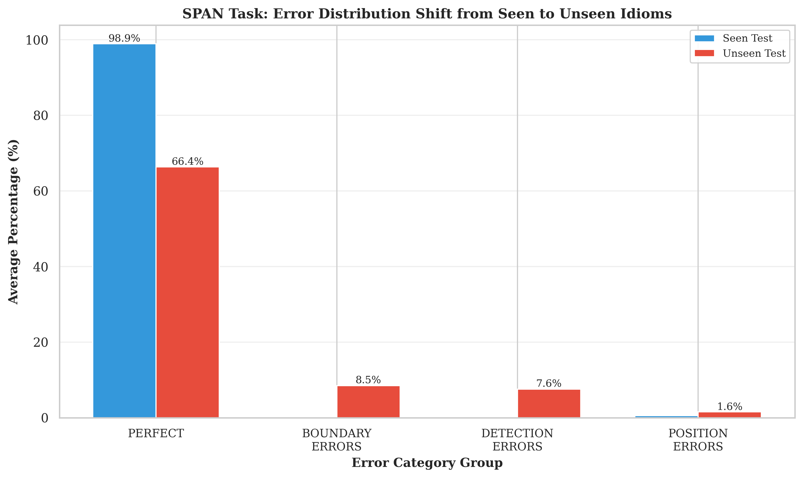

<div align="center">

# Detection Without Localization

### Compositional Generalization Failures in Transformer Models for Hebrew Idiom Boundaries

*Dataset Construction, Fine-Tuning, and Prompting-Based Evaluation*

[](https://www.python.org/downloads/)
[](https://pytorch.org/)
[](https://github.com/huggingface/transformers)
[](LICENSE)
[](https://creativecommons.org/licenses/by/4.0/)

**Igor Nazarenko & Yuval Amit** | Reichman University | Supervised by Dr. Kfir Bar

[Paper (PDF)](paper/report/Hebrew_Idiom_Detection_Report.pdf) &bull; [Presentation](presentation/) &bull; [Dataset](data/) &bull; [Results](#-key-results) &bull; [Reproduce](docs/REPRODUCING.md)

</div>

<br>

> **TL;DR** &mdash; We build the first Hebrew idiom dataset with dual-task annotations (4,800 sentences, 60 idioms) and benchmark 6 transformer encoders + 5 LLMs. Models can *detect* idioms in unseen expressions (F1 0.90&ndash;0.92) but fail to *locate* their boundaries (F1 0.59&ndash;0.76), revealing memorization rather than compositional understanding. LLM prompting shows reversed error patterns and Gemini 3 Flash outperforms all fine-tuned models on boundary generalization.

---

## Table of Contents

- [Key Results](#-key-results)
- [Dataset](#-dataset-hebrew-idioms-4800)
- [Models](#-models)
- [Getting Started](#-getting-started)
- [Repository Structure](#-repository-structure)
- [Paper & Presentation](#-paper--presentation)
- [Citation](#-citation)
- [Authors](#-authors--acknowledgments)

---

## Key Results

### The Generalization Gap

<p align="center">
  
  &nbsp;&nbsp;
  
</p>

<p align="center"><em>Left: Classification (CLS) generalizes robustly. Right: Span identification (SPAN) collapses on unseen idioms.</em></p>

<br>

### Fine-Tuned Encoder Results (Mean F1 &plusmn; Std, 3 Seeds)

| Model | CLS Seen | CLS Unseen | SPAN Seen | SPAN Unseen |
|:------|:--------:|:----------:|:---------:|:-----------:|
| **NeoDictaBERT** | **95.8** &plusmn; 1.2 | **92.4** &plusmn; 0.3 | **99.7** &plusmn; 0.1 | 66.1 &plusmn; 7.0 |
| DictaBERT | 94.1 &plusmn; 0.3 | 92.2 &plusmn; 0.4 | 99.4 &plusmn; 0.2 | **76.1** &plusmn; 4.8 |
| AlephBERTGimmel | 94.0 &plusmn; 1.2 | 90.8 &plusmn; 1.2 | 99.0 &plusmn; 0.1 | 74.7 &plusmn; 1.5 |
| AlephBERT | 93.0 &plusmn; 0.3 | 91.0 &plusmn; 0.7 | 99.4 &plusmn; 0.3 | 66.8 &plusmn; 2.1 |
| XLM-RoBERTa | 91.2 &plusmn; 1.4 | 90.7 &plusmn; 0.5 | 99.4 &plusmn; 0.2 | 61.5 &plusmn; 3.6 |
| mBERT | 88.8 &plusmn; 0.5 | 90.4 &plusmn; 0.7 | 99.5 &plusmn; 0.2 | 58.8 &plusmn; 8.0 |

<sub>All values are F1 percentages. Seeds: 42, 123, 456. Bootstrap 95% CIs in <a href="experiments/results/analysis/finetuning_summary.md">full analysis</a>.</sub>

<br>

### Error Analysis

<p align="center">
  
</p>

<p align="center"><em>SPAN error distribution shifts dramatically from seen (99% correct) to unseen idioms.</em></p>

| Finding | Detail |
|:--------|:-------|
| **Boundary bias** | 1,761 partial-end errors vs. 1 partial-start across all models |
| **Length effect** | Unseen idioms with 5+ tokens: 70&ndash;100% error rates |
| **LLM reversal** | Prompted LLMs show opposite error patterns (5&ndash;13% partial-start) |
| **Gemini 3 Flash** | 90% SPAN F1 on unseen idioms &mdash; exceeds best fine-tuned model (76.1%) |

---

## Dataset: Hebrew-Idioms-4800

The **first comprehensive Hebrew idiom dataset** with dual-task annotations for both sentence-level classification and token-level span identification.

| | |
|:--|:--|
| **Sentences** | 4,800 (80 per idiom) |
| **Idioms** | 60 unique, 100% polysemous |
| **Balance** | 50/50 literal / figurative |
| **Agreement** | Cohen's &kappa; = 0.97 |
| **Annotation** | 2 native Hebrew speakers |
| **Sentence length** | 17.5 tokens (mean), 5&ndash;47 range |
| **Idiom length** | 2.5 tokens (mean), 2&ndash;5 range |

**Splits:**

| Split | Sentences | Idioms | Purpose |
|:------|----------:|:-------|:--------|
| Train | 3,456 | 54 seen | Model training |
| Validation | 432 | 54 seen | Model selection |
| Seen Test | 432 | 54 seen | In-domain evaluation |
| Unseen Test | 480 | 6 held-out | Zero-shot generalization |

<details>
<summary><strong>Example annotation</strong></summary>

```
Hebrew:      "אבי שבר את הקרח במועדון הספורט בשיחה על נבחרת ישראל."
Translation:  Avi broke the ice at the sports club talking about the Israeli national team.
Idiom:        שבר את הקרח  (broke the ice)
Label:        Figurative
BIO tags:     O  B-IDIOM  I-IDIOM  I-IDIOM  O  O  O  O  O  O  O
```

</details>

Full schema, quality metrics, and construction methodology: [`data/README.md`](data/README.md)

---

## Models

### Fine-Tuned Encoders (6)

| Model | HuggingFace ID | Type | Params |
|:------|:---------------|:-----|-------:|
| AlephBERT | `onlplab/alephbert-base` | Hebrew | ~128M |
| AlephBERTGimmel | `dicta-il/alephbertgimmel-base` | Hebrew | ~128M |
| DictaBERT | `dicta-il/dictabert` | Hebrew | ~128M |
| NeoDictaBERT | `dicta-il/neodictabert` | Hebrew | ~128M |
| mBERT | `bert-base-multilingual-cased` | Multilingual | ~110M |
| XLM-RoBERTa | `xlm-roberta-base` | Multilingual | ~125M |

### LLM Prompting Baselines (5)

| Model | Setting |
|:------|:--------|
| Gemini 3 Flash Preview | Zero-shot & few-shot (k=3) |
| Llama 4 Maverick Instruct | Zero-shot & few-shot (k=3) |
| Llama 4 Scout Instruct | Zero-shot & few-shot (k=3) |
| Dicta 3 Nemotron 12B | Zero-shot & few-shot (k=3) |
| Qwen 3 235B A22B | Zero-shot & few-shot (k=3) |

---

## Getting Started

```bash
# Clone
git clone https://github.com/igornazarenko434/hebrew-idiom-detection.git
cd hebrew-idiom-detection

# Environment
python -m venv .venv && source .venv/bin/activate
pip install -r requirements.txt

# Verify
python -c "import torch, transformers; print('Ready')"
```

**Analyze pre-computed results** (no GPU needed):

```bash
python src/analyze_finetuning_results.py    # Summary tables + bootstrap CIs
python src/analyze_generalization.py        # Seen vs unseen gap analysis
python scripts/statistical_tests.py         # Paired t-tests + Bonferroni correction
```

**Full reproduction** (GPU required): see [`docs/REPRODUCING.md`](docs/REPRODUCING.md)

---

## Repository Structure

```
hebrew-idiom-detection/
|
+-- data/                        # Hebrew-Idioms-4800 dataset + splits
+-- src/                         # Core training & evaluation code
|   +-- idiom_experiment.py      #   Main runner (train / eval / HPO)
|   +-- data_preparation.py      #   Data loading & preprocessing
|   +-- utils/                   #   Tokenization, error analysis
+-- scripts/                     # Analysis & automation scripts
+-- experiments/
|   +-- configs/                 #   YAML training configs
|   +-- results/                 #   All outputs (analysis, evaluation, checkpoints)
+-- paper/
|   +-- report/                  #   Final thesis (PDF + LaTeX)
|   +-- figures/                 #   Publication-ready figures
+-- presentation/                # Self-contained HTML5 slide deck
+-- notebooks/                   # Jupyter notebooks
+-- docker/                      # Docker setup
+-- tests/                       # Unit tests
+-- docs/                        # Reproduction guide + supplementary docs
```

---

## Paper & Presentation

| Resource | Link |
|:---------|:-----|
| Full Report (PDF) | [`paper/report/Hebrew_Idiom_Detection_Report.pdf`](paper/report/Hebrew_Idiom_Detection_Report.pdf) |
| Slide Deck | Open [`presentation/index.html`](presentation/index.html) in browser |
| LaTeX Source | [`paper/conll2026_paper.tex`](paper/conll2026_paper.tex) |

---

## Citation

```bibtex
@mastersthesis{nazarenko2026hebrew,
    title   = {Detection Without Localization: Compositional Generalization
               Failures in Transformer Models for Hebrew Idiom Boundaries},
    author  = {Nazarenko, Igor and Amit, Yuval},
    school  = {Reichman University, Efi Arazi School of Computer Science},
    year    = {2026},
    type    = {M.Sc. Thesis},
    note    = {Machine Learning and Data Science Track}
}
```

---

## Authors & Acknowledgments

|  | Name | Role |
|:--|:-----|:-----|
| | **Igor Nazarenko** | Dataset construction, fine-tuning pipeline, error analysis, interpretability |
| | **Yuval Amit** | LLM prompting evaluation, dataset construction, annotation |

**M.Sc. Machine Learning & Data Science**, Efi Arazi School of Computer Science, Reichman University

**Supervisor:** Dr. Kfir Bar

We thank **Kai Golan Hashiloni** for his guidance throughout the project, including initial review and continuous support.

---

## License

| Component | License |
|:----------|:--------|
| Code | [MIT](LICENSE) |
| Dataset (Hebrew-Idioms-4800) | [CC BY 4.0](https://creativecommons.org/licenses/by/4.0/) |
